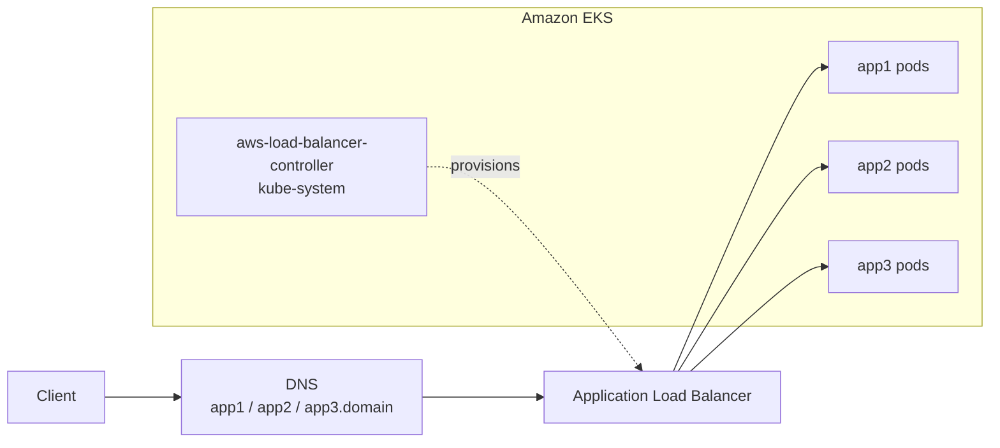

# Microservices on Amazon EKS with the AWS Load Balancer Controller

Three Flask microservices on Amazon EKS behind a single Application Load Balancer created by the AWS Load Balancer Controller, with three ways to route traffic to them: by path, by path over HTTPS, and by subdomain.


<p>
  
  
  
</p>

## What this demonstrates

- Granting a controller AWS permissions through IAM roles for service accounts, with no static credentials in the cluster
- Three routing strategies on a single load balancer: by path, by path over HTTPS with ACM, and by subdomain
- Sharing one load balancer across ingress resources to keep cost down

## Services

| Service | Source | Page |
|---|---|---|
| `app1` | `ms-1/` | Customer Service Portal |
| `app2` | `ms-2/` | Analytics Dashboard |
| `app3` | `ms-3/` | API Gateway |

Each is a Flask app on port 5000 with its own `Dockerfile`, plus a Deployment and Service in `k8s/app1.yaml` to `k8s/app3.yaml`.

## Routing options

| Manifest | Routing |
|---|---|
| `k8s/ingress.yaml` | Path-based over HTTP: `/app1`, `/app2` and `/app3`, with `/` sent to app1 |
| `k8s/ingress-https.yaml` | Path-based on your domain, with an HTTPS listener using an ACM certificate, HTTP redirected to HTTPS, and a TLS 1.2 security policy |
| `k8s/ingress-subdomain.yaml` | Host-based over HTTPS: `app1.<domain>`, `app2.<domain>` and `app3.<domain>`, with the apex and `www` sent to app1 |

The load balancer health-checks every service on `/health`. The HTTPS manifests use `target-type: ip`, so traffic goes straight to pod IPs, and share one ALB through the `group.name` annotation.

## Architecture



## Setup

`Guide.txt` contains every command used. In summary:

1. Install the AWS CLI, `kubectl` and `eksctl` on a workstation with an IAM role attached.
2. Create the cluster:

   ```bash
   eksctl create cluster --name <cluster> --region ap-south-1 \
     --node-type t2.medium --zones ap-south-1a,ap-south-1b
   ```

3. Build the three images and push them to your registry.
4. Associate an IAM OIDC provider with the cluster:

   ```bash
   eksctl utils associate-iam-oidc-provider --region ap-south-1 --cluster <cluster> --approve
   ```

5. Create the controller's IAM policy from the `iam_policy.json` published by the AWS Load Balancer Controller project.
6. Create the `aws-load-balancer-controller` service account in `kube-system` with that policy attached (IAM Roles for Service Accounts).
7. Install the controller with Helm from the `eks/aws-load-balancer-controller` chart.
8. Apply the three services and one of the Ingress manifests, then point your DNS records at the ALB's DNS name.

Before applying, replace the image names in `k8s/app*.yaml`, the placeholder ACM certificate ARN, and `learndevops01.click` with your own values.

## Cost

The ALB and the EKS control plane are billed by the hour. Delete the Ingress, which removes the ALB, and then the cluster when you are done:

```bash
kubectl delete -f k8s/
eksctl delete cluster --name <cluster> --region ap-south-1
```

## Credits

Based on [KastroVKiran/aws-lb-controller-domain-configuration](https://github.com/KastroVKiran/aws-lb-controller-domain-configuration) from Learn With Kastro.

---

<div align="center">
  <sub>Maintained by <a href="https://github.com/RajGenStack">Rajan Kumar</a> · <a href="https://www.linkedin.com/in/rajan-kumar42">LinkedIn</a></sub>
</div>
